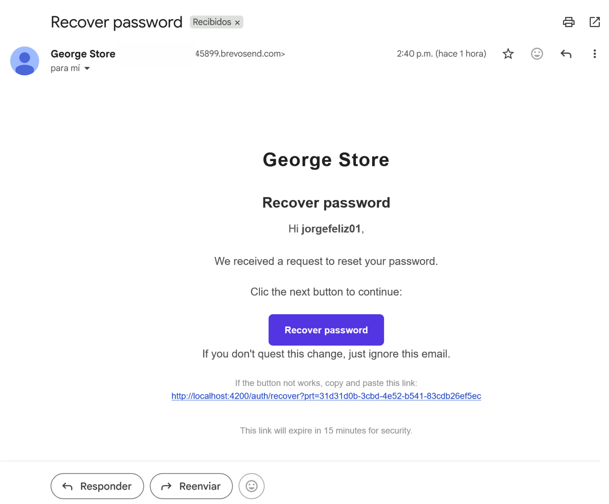
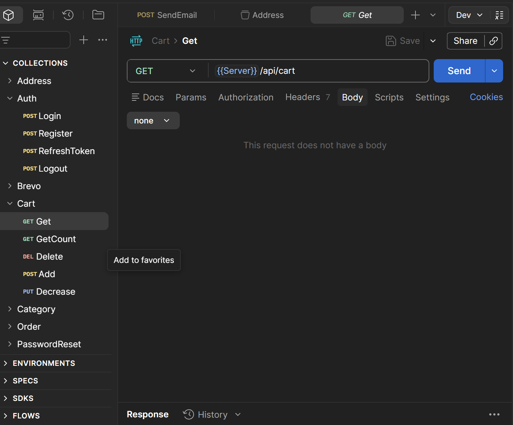

# GeorgeStore API

API REST para una plataforma E-Commerce Full Stack desarrollada con ASP.NET Core.

GeorgeStore API permite administrar productos, carritos de compra, pedidos, direcciones, métodos de pago y autenticación de usuarios mediante JWT. El proyecto fue desarrollado con una estructura modular organizada por características, inspirada parcialmente en el enfoque Vertical Slice Architecture.

---

## Características

- Autenticación y autorización con JWT
- Manejo de Refresh Tokens
- Recuperación de contraseñas mediante correo electrónico
- Administración de productos y categorías
- Carrito de compras
- Creación y administración de pedidos
- Reordenamiento de pedidos
- Administración de direcciones (CRUD)
- Administración de métodos de pago (CRUD)
- Paginación y filtrado
- Pruebas unitarias
- Integración con Brevo para envío de correos electrónicos
- Arquitectura modular organizada por características

---

## Arquitectura

El proyecto está dividido por características para mantener una estructura más modular y escalable.

```txt
Features/
├── Auth/
├── Products/
├── Orders/
├── Users/
├── Carts/
├── Addresses/
├── PaymentMethods/
├── PasswordRecovery/
```

Cada característica contiene su propia lógica relacionada, como:

- Controllers
- DTOs
- Repositories
- Services
- Errors
- Domain models

Además, el proyecto separa responsabilidades mediante carpetas como:

```txt
Common/
Infrastructure/
Templates/
Extensions/
```

Aunque el proyecto toma inspiración de **Vertical Slice Architecture**, también mezcla elementos de otros enfoques para mantener una estructura práctica y fácil de extender.

---

## Autenticación

La autenticación se maneja mediante **JWT** y **Refresh Tokens**.

La API permite:

- Registro de usuarios
- Inicio de sesión
- Manejo de Refresh Tokens
- Renovación de tokens
- Recuperación de contraseñas mediante correo electrónico

---

## Recuperación de contraseña

La recuperación de contraseña se realiza mediante envío de correo electrónico utilizando Brevo como proveedor de emails.

### Correo de recuperación



---

## Tecnologías

### Backend

- ASP.NET Core
- Entity Framework Core
- Dapper
- SQL Server
- JWT Authentication

### Testing

- xUnit

### Infraestructura y herramientas

- Brevo Email API

---

## Pruebas

El proyecto **incluye pruebas unitarias en xUnit** para múltiples características del sistema:

```txt
Addresses/
Auth/
Carts/
Orders/
PasswordRecoveries/
PaymentMethods/
Products/
Users/
```

---

## Base de datos

La aplicación utiliza SQL Server como sistema gestor de base de datos.

El proyecto incluye:

- Configuraciones Fluent API
- Seed de datos iniciales mediante archivos JSON

---

## Colección Postman

https://www.postman.com/georgestoreorg/georgestore-postman/overview




---

## Instalación
El repositorio ya incluye datos semilla funcionales, por lo que puedes ejecutar el proyecto y probarlo directamente después de configurar la base de datos.

---

## Frontend

Este backend es consumido por una aplicación frontend desarrollada en Angular:

https://github.com/JorgeGerardo/GeorgeStoreClient
